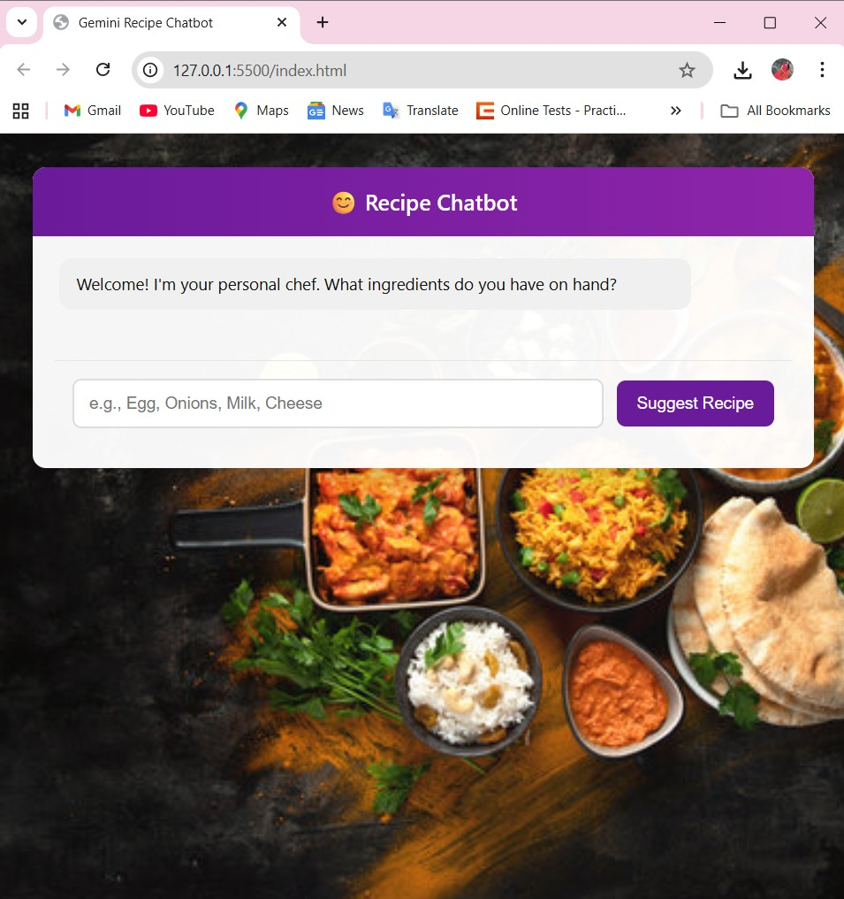

# 🍳 Local AI Recipe Chatbot

An intelligent **AI-powered recipe chatbot** that suggests dishes based on ingredients you provide.  
It uses **FastAPI** for the backend, **Sentence Transformers + FAISS** for semantic search, and a simple **HTML + JavaScript frontend** for the chat interface.
---

## 🧩 Project Architecture

```bash
recipe_chatbot/
│
├── ⚙️ Backend System
|    |__backend/
│         ├── preprocess.py           # 🧹 Cleans and preprocesses raw recipe data
│         ├── build_index.py          # 🧠 Builds FAISS embeddings for semantic search
│         ├── server.py               # 🚀 FastAPI server for chatbot communication
│         ├── quantity_generator.py   # 📏 Generates ingredient quantities dynamically
│         └── models/                 # 💾 Stores FAISS index and metadata files
│
├── 📊 Data System
│   └── data/
│       └── recipe.json         # 🍲 Recipe dataset used for fine-tuning
│
├── 💻 Frontend Interface
│   └── frontend/
│       ├── index.html          # 🌐 Web UI for user interaction
│       ├── background.jpg      # 🎨 Background image for chat interface
│       ├── bot_start.png       # 🖼️ Chatbot initial state screenshot
│       └── bot_response.png    # 🖼️ Chatbot response screenshot
│
├── 🧾 Environment & Dependencies
│   ├── requirements.txt        # 📦 Python libraries required for the project
│   └── venv/                   # 🧬 Virtual environment (optional, local setup)
│
└── 📘 Documentation
    └── README.md               # 🪶 Project overview and setup guide
```
---

## ⚙️ Setup Instructions

### 1️⃣ Prerequisites
Make sure **Python 3.8+** and **pip** are installed.

```bash
python --version
pip --version
```
---

### 2️⃣ Create and Activate Virtual Environment

```bash
# Create virtual environment
python -m venv venv

# Activate it
# On Windows:
venv\Scripts\activate.bat
# On Mac/Linux:
source venv/bin/activate
```
---

### 3️⃣ Install Dependencies

Install all required Python libraries listed in `requirements.txt`.

```bash
pip install -r requirements.txt
```

If FAISS installation fails on Windows, use:

```bash
pip install faiss-cpu -f https://download.pytorch.org/whl/
```
---

## 🚀 How to Run the Project

### 🥣 Step 1: Preprocess Recipe Data
Converts raw recipes into cleaned JSON lines format.

```bash
cd backend
python preprocess.py
```

**Output:**  
`models/recipes_clean.jsonl`

---

### 🍱 Step 2: Build Embeddings + FAISS Index
Encodes ingredients and creates a searchable FAISS index.

```bash
python build_index.py
```


**Output:**  
- `models/recipes.index`  
- `models/recipes_meta.json`

---

### 🔥 Step 3: Run Backend Server (FastAPI)
Start your local API server.

```bash
python -m uvicorn server:app --reload
```

The backend runs at → **http://127.0.0.1:8000**


### 💻 Step 4: Run Frontend
In a new terminal, start the frontend server:

```bash
cd frontend
python -m http.server 5500
```


Open your browser and go to:  
👉 **http://127.0.0.1:5500/index.html**


## 💬 How to Use

1. Enter ingredients in the input box (e.g., `palak, paneer, cream`).
2. Click **“Suggest Recipe.”**
3. The AI chatbot will suggest the most relevant recipe from your dataset, including:
   - Recipe name  
   - Auto-generated ingredient quantities  
   - Step-by-step cooking instructions  


## 🧾 Sample Input & Output

### Input:
```
palak, paneer, cream
```


### Output:
```
🍽️ Recipe: Palak Paneer  
🧂 Ingredients: 4 cups palak, 1 ml paneer, 2 tbsp cream  
👨‍🍳 Instructions:
1. Prepare all ingredients for Palak Paneer.
2. Blanch and blend palak into a smooth paste.
3. Heat oil, add spices, and sauté.
4. Add paneer cubes and cream, mix well.
5. Serve hot with roti or naan.
```


## 🧠 Working Flow

| Step | Description |
|------|--------------|
| 1️⃣ | Data preprocessing to clean recipe dataset |
| 2️⃣ | Embeddings generation using `SentenceTransformer` |
| 3️⃣ | FAISS index creation for semantic recipe search |
| 4️⃣ | FastAPI backend handles requests |
| 5️⃣ | Frontend connects to backend API and displays results |


## 🖼️ Screenshots

### 1️⃣ Starting the Bot


### 2️⃣ After Giving Ingredients


> _Rename your uploaded images as follows and place them inside the `frontend/` folder:_
> - `bot_start.png` → first image (welcome screen)  
> - `bot_response.png` → second image (Palak Paneer result)


## ✅ Verification Steps

1. Activate the virtual environment.  
2. Run preprocessing and build index.  
3. Launch backend (`uvicorn`) and frontend (`python -m http.server`).  
4. Visit the local URL and test with any ingredients.  
5. Verify that:
   - API returns recipes  
   - Frontend chatbot UI displays response correctly  
   - The project runs entirely offline  


## 📦 Deliverables Checklist

-  Complete runnable code  
-  All dependencies in `requirements.txt`  
-  README with full setup and usage instructions  
-  Sample input and output  
-  Screenshots for verification  
